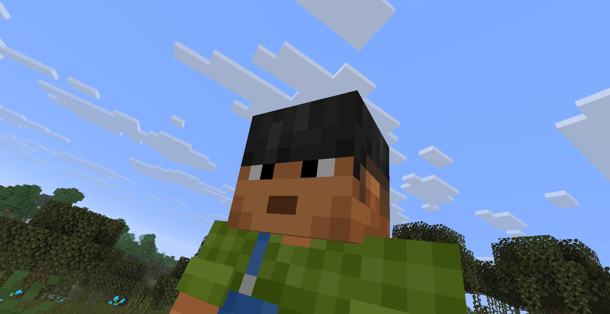

# Free Camera

A Minecraft Fabric mod that gives you full, cinematic control over the third-person camera.




## Features

- **Free Camera Rotation** — In third-person front mode (F5), move your mouse to rotate the camera independently from your character.
- **Cinematic Smoothness** — Camera rotation and movement smoothly interpolate, giving a cinematic feel.
- **Adjustable Distance & FOV Zoom** — Scroll to zoom in or out. The FOV dynamically adjusts with distance for a natural zooming effect.
- **Camera Detach (Lock)** — Press **F7** to detach and lock the camera in its current position while your character moves freely.
- **Camera Roll** — Press **Z / C** to tilt (roll) the camera on the Z axis.
- **Reset Camera** — Press **R** to reset your camera's angle, roll, and distance back to default.
- **Quick Toggle** — Press **F6** to toggle the Free Camera mod on or off.

## Usage

1. Press **F5** to enter the **Third-Person Front** perspective (the mod only activates in this mode).
2. Move your mouse to rotate the camera.
3. Scroll to adjust distance and FOV.
4. Press **F7** to leave the camera behind and walk away.
5. Use **Z/C** for cinematic rolls, and **R** to reset.
6. Press **F6** if you want to temporarily disable the mod's overrides.

## Config

Settings are saved in `config/free-camera.json`:

```json
{
  "cameraDistance": 4.0,
  "rotationSensitivity": 1.0,
  "smoothness": 0.0,
  "fovZoom": 1.0,
  "cameraRoll": 0.0
}
```

## Installation

Requires [Fabric Loader](https://fabricmc.net/use/installer/) and [Fabric API](https://modrinth.com/mod/fabric-api).

## License

MIT
