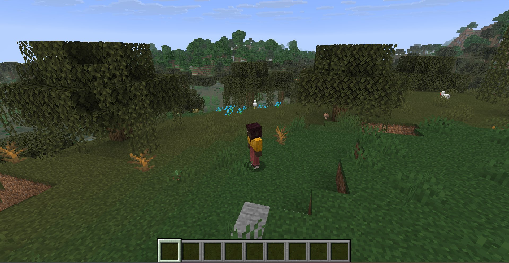

# Free Camera

A Minecraft Fabric mod that gives you full control over the third-person camera.



## Features

- **Free camera rotation** — In third-person mode, move your mouse to rotate the camera independently from your character
- **Adjustable camera distance** — Scroll to zoom in or out (range: 1.0 – 20.0, default: 4.0)
- **Independent movement** — Your character moves and turns normally while the camera stays where you left it

## Usage

1. Press **F5** to enter third-person mode
2. Move your mouse to rotate the camera freely
3. Scroll to adjust the camera distance
4. Your character moves independently — the camera won't follow their rotation

## Config

On first use, a config file is created at `/config/free-camera.json`:

```json
{
  "cameraDistance": 4.0,
  "rotationSensitivity": 1.0
}
```

## Installation

Requires [Fabric Loader](https://fabricmc.net/use/installer/) and [Fabric API](https://modrinth.com/mod/fabric-api).

## License

MIT
